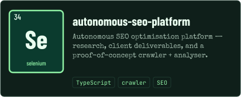
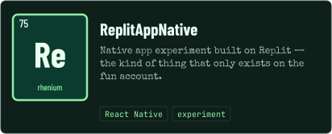
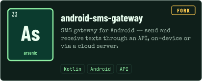
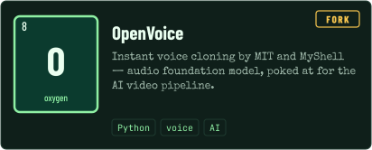
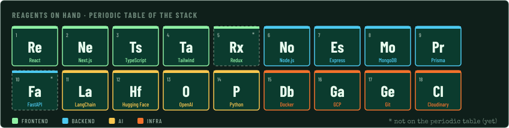
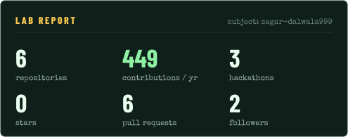

<!-- Generated by .github/scripts/build.py — edit content.py and re-run, or edit this file directly (assets stay the same). -->

  

  

  
  

  
  

  
  <!-- streak card is live from streak-stats.demolab.com — delete the next line to hide it -->
  

  
  

  

  
  
  

